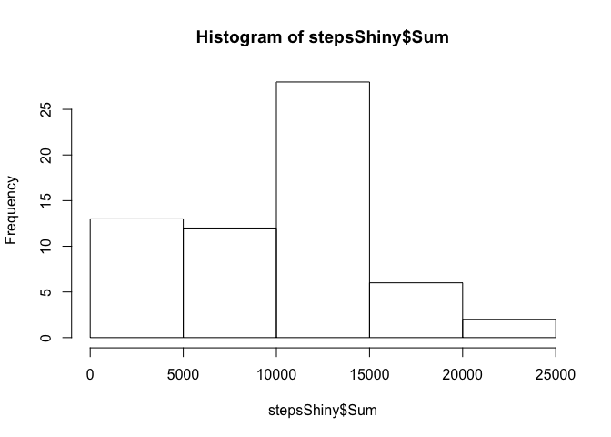

# Reproducible Research: Peer Assessment 1
Michael Jenkins  


## Loading and preprocessing the data

First, unzip the data read it into a new data table.

```r
library(data.table)
unzip("activity.zip")
DTRaw <- data.table(read.csv("activity.csv"))
```

Convert the date column to the appropriate date format in R.  Create a clean data set by omitting NAs.

```r
DTRaw$date <- as.Date(DTRaw$date, format = "%Y-%m-%d")
DT <- na.omit(DTRaw)
```


## What is mean total number of steps taken per day?

Create a new data table with the total number of steps taken each day.  

```r
sumSteps <- DT[,list(Sum=sum(steps)), by=date]
```

Store and display the mean and median total number of steps taken per day.

```r
meanStep <- mean(sumSteps$Sum)
medianStep <- median(sumSteps$Sum)
print(meanStep)
```

```
## [1] 10766.19
```

```r
print(medianStep)
```

```
## [1] 10765
```

Create a histogram of the total number of steps taken each day.

```r
hist(sumSteps$Sum)
```

 

## What is the average daily activity pattern?

Plot the mean number of steps by intervals across all days.

```r
DTactive <- DT[, list(Mean=mean(steps), Median=median(steps)), by=interval]
plot(DTactive$interval, DTactive$Mean, type="l")
```

 

Return the interval that on average across all the days in the dataset, contains the maximum number of steps.


```r
print(DTactive$interval[DTactive$Mean==max(DTactive$Mean)])
```

```
## [1] 835
```

## Imputing missing values

Lets return to the raw data table to replace NA's with something more usable.  First lets find how many rows contain NA's.


```r
print(sum(is.na(DTRaw)))
```

```
## [1] 2304
```

Lets replace all the NA values with the average number of steps for that interval.  To do this we will need to creat a new table with a column for average number of steps for the associated interval.


```r
setkey(DTRaw, interval)
setkey(DTactive, interval)
DTshiny <- merge(DTRaw, DTactive)
DTshiny$steps[is.na(DTshiny$steps)] <- DTshiny$Median[is.na(DTshiny$steps)]
print(sum(is.na(DTshiny)))
```

```
## [1] 0
```


```r
stepsShiny <- DTshiny[, list(Sum=sum(steps)), by=date]
hist(stepsShiny$Sum)
```

 

```r
meanStepShiny <- mean(stepsShiny$Sum)
medianStepShiny <- median(stepsShiny$Sum)
print(list("Mean Steps excluding NA Values"=meanStep, "Mean Steps replacing NA values with the median for the interval"=meanStepShiny))
```

```
## $`Mean Steps excluding NA Values`
## [1] 10766.19
## 
## $`Mean Steps replacing NA values with the median for the interval`
## [1] 9503.869
```

```r
print(list("Median Steps excluding NA Values"=medianStep, "Median Steps replacing NA values with the median for the interval"=medianStepShiny))
```

```
## $`Median Steps excluding NA Values`
## [1] 10765
## 
## $`Median Steps replacing NA values with the median for the interval`
## [1] 10395
```

From the results we can see replacing NA values with the median steps for the time intervals reduces both the overall average and median steps taken per day.

## Are there differences in activity patterns between weekdays and weekends?

Add a column to display if the date is a weekday or weekend

```r
DTshiny[, Type := weekdays(date) == "Saturday" | weekdays(date) == "Sunday"]
```

```
##        interval steps       date     Mean Median  Type
##     1:        0     0 2012-10-01 1.716981      0 FALSE
##     2:        0     0 2012-10-02 1.716981      0 FALSE
##     3:        0     0 2012-10-03 1.716981      0 FALSE
##     4:        0    47 2012-10-04 1.716981      0 FALSE
##     5:        0     0 2012-10-05 1.716981      0 FALSE
##    ---                                                
## 17564:     2355     0 2012-11-26 1.075472      0 FALSE
## 17565:     2355     0 2012-11-27 1.075472      0 FALSE
## 17566:     2355     0 2012-11-28 1.075472      0 FALSE
## 17567:     2355     0 2012-11-29 1.075472      0 FALSE
## 17568:     2355     0 2012-11-30 1.075472      0 FALSE
```

```r
DTshiny$Type[DTshiny$Type == TRUE] <- "weekend"
DTshiny$Type[DTshiny$Type == FALSE] <- "weekday"
```

Plot the activity patterns for Weekends and Weekdays

```r
library(lattice)
xyplot(steps ~ interval | Type, 
           data = DTshiny,
           type = "l",
           xlab = "Interval",
           ylab = "Number of steps",
           layout=c(1,2))
```

 

From the graphs we see more steps are taken during the earlier intervals on weekdays, and the later intervals on weekends.

